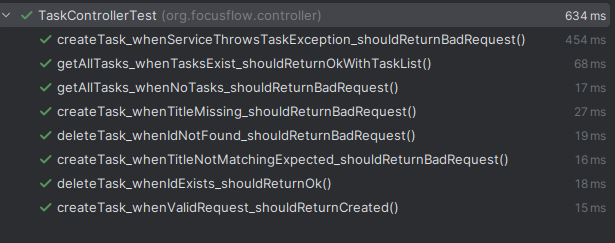

# FocusFlow Exercise 9 – API Testing

## Exercise 9.1
Base URL: http://localhost:8082 \

Endpoints:
* [GET] "/tasks/list"
  * list all tasks
    * RequestSchema:
      * /tasks/list
* [POST] "/tasks/create"
  * create a new task
    * RequestSchema:
      *  {\
        "title": "This is the first one",\
        "shortDescription": "short",\
        "longDescription": "This is the long description"\
        }
* [DELETE] "/tasks/delete/{id}"
  * deletes a task
    * RequestSchema:
      * /tasks/delete/1

## Exercise 9.2
Tests are made in Postman. Postman is a versatile tool to use and made testing process much more convenient. Yet it offers flexibility to adjust every parameter.

**Successful POST request Endpoint : /tasks/create**

**Request**

{
"title": "this should be title",\
"shortDescription": "short",\
"longDescription": "This is the long description"
}

**Response**

{
"timestamp": "2025-05-27T23:05:47.247112555",\
"status": 201,\
"message": "Task created successfully",\
"data": null\
}

**Unsuccessful POST request Endpoint : /tasks/create**

**Request**

This request has 2 errors. "titl" should be "title" and "shortDescription" should not be null. It can be seen in the response that succesfully raised 2 exceptions.

{
"titl": "this should be title",\
"shortDescription": "",\
"longDescription": "This is the long description"
}

**Response**

{
"path": "/tasks/create",\
"error": "Validation Error",\
"errors": {\
"shortDescription": "Short description is required",\
"title": "Title is required"},\
"timestamp": "2025-05-27T22:56:39.697948062",\
"status": 400
}

## Exercise 9.3

When `docker-compose build` is run automatically tests are run too. Also in Intellij IDEA can be run manually. 

## Exercise 9.4

- Apache JMeter 5.6.3
- jmx files are under docs/jmx/

## Test A: Constant Load

- **Response Time (Avg)**: 526 ms
- **Throughput**: 19.0 req/sec
- **Error Rate**: 0.00%

**Comment:**  
The system handles constant traffic efficiently. Low response times and no errors indicate stable performance under predictable load.

---

## Test B: Spike Load

- **Response Time (Avg)**: 4671 ms
- **Throughput**: 14.6 req/sec
- **Error Rate**: 7.63%

**Comment:**  
Spike load led to significantly higher response times and a noticeable error rate. This suggests performance degradation under sudden traffic surges. The system may require scaling improvements or optimizations to handle burst traffic.

